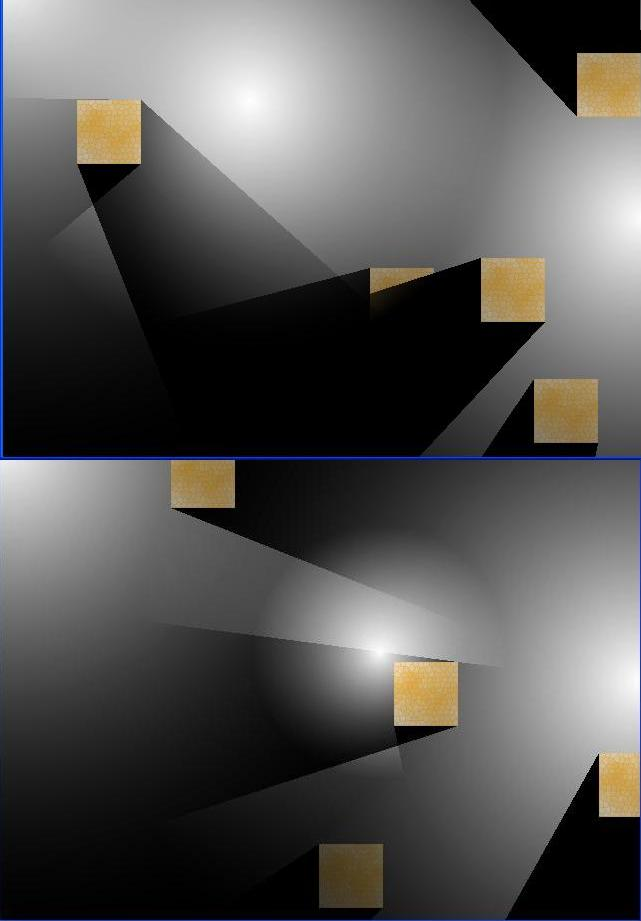



## DirectX, Realtime Lighting with Dynamic Stencil Shadows

### Description

This code shows how to use DirectX to render realtime lightmaps. 2 buffers are used, a scene buffer and a light buffer. The lights &amp; shadows of a scene are first rendered to the backbuffer(stencil shadows), and then the backbuffer's contents are copied to the light buffer. The backbuffer is then cleared and the scene is rendered, after which the backbuffer is copied to the scenebuffer. The final part is to render the scene buffer multiplied by the light buffer onto the backbuffer.

1 of the 3 lights in this demo can be moved around with the mouse.

Note that this demo does not work properly if 2 objects are intersecting as on the area they intersect, they cut out the shadows and cast shadows from around the point of intersection.

Please post any comments you have...
 
### More Info
 

             |
---                |---
**Submitted On**   |2005-08-04 20:29:56
**By**             |[CadeF](https://github.com/Planet-Source-Code/PSCIndex/blob/master/ByAuthor/cadef.md)
**Level**          |Advanced
**User Rating**    |5.0 (25 globes from 5 users)
**Compatibility**  |VB 6\.0
**Category**       |[DirectX](https://github.com/Planet-Source-Code/PSCIndex/blob/master/ByCategory/directx__1-44.md)
**World**          |[Visual Basic](https://github.com/Planet-Source-Code/PSCIndex/blob/master/ByWorld/visual-basic.md)
**Archive File**   |[DirectX\_\_R193017962005\.zip](https://github.com/Planet-Source-Code/cadef-directx-realtime-lighting-with-dynamic-stencil-shadows__1-62459/archive/master.zip)

